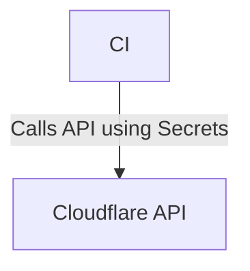

Cloudflare Worker - workerdanver1

🚀 Cloudflare Worker 自動部署 & 測試專案

目前專案已整合：

✅ GitHub Actions 自動部署

✅ 基礎路由處理（含主頁 / 路由）

✅ Cloudflare 全球邊緣網路部署


🌟 功能說明

路由結構：

📦 安裝與部署

1. 克隆此存放庫：


git clone https://github.com/你的帳號/Cloudflared-web.git
cd Cloudflared-web

2. 修改程式碼：


編輯 index.js 增加功能或修改路由


3. 推送變更：


git add .
git commit -m "feat: update routes and readme"
git push origin main

4. 部署自動觸發 🎉


GitHub Actions 會自動部署到 Cloudflare Workers

完成後即可訪問：https://workerdanver1.haveanewlife.workers.dev/


🛠️ TODO 計劃

[ ] 加入自動健康檢查回報

[ ] 整合 webhook 通知（如：LINE Notify、Telegram）

[ ] 批量 API 路由與引數處理

[ ] 測試自動化部署完成提示


🤝 貢獻

歡迎提出 issue 或 Pull Request，共同優化此專案！

📄 授權

MIT License


---

🔗 Cloudflare Worker 頁面： 前往查看

📝 記得： 更新完程式後，記得同步 README.md，保持專案文件清晰明瞭！

<<<<<<< HEAD
=======

example `docker-compose.yaml`:
```yaml
services:
  cloudflared:
    image: wisdomsky/cloudflared-web:latest
    restart: unless-stopped
    network_mode: host
    environment:
      WEBUI_PORT: 1111
      PROTOCOL: http2
```


### Volume
| Container Path | Required or Optional | Description |
|---|---|---|
| /config | _Optional_ | The path to the directory where the `config.json` file containing the Cloudflare token and start status will be saved.  |

example `docker-compose.yaml`:
```yaml
services:
  cloudflared:
    image: wisdomsky/cloudflared-web:latest
    restart: unless-stopped
    network_mode: host
    volumes:
      - /mnt/storage/cloudflared/config:/config
```

## Using Networks

You can use docker `networks` for a more fine-grained control of which containers/services your cloudflared-web container has access to.

```yaml
services:
  cloudflared:
    image: wisdomsky/cloudflared-web:latest
    restart: unless-stopped
    networks:
      - mynetwork
    environment:
      WEBUI_PORT: 1111
```

## Architecture Diagram



## Screenshots


---

## Issues

For any problems experienced while using the docker image, please [create a new issue](https://github.com/WisdomSky/Cloudflared-web/issues).

--- 

## Contribute


### Adding A Language Translation

See [Localization](https://github.com/WisdomSky/Cloudflared-web/wiki/Localization).
>>>>>>> 92085110db7ee01f446928f6b3c3c82efc1edec1
